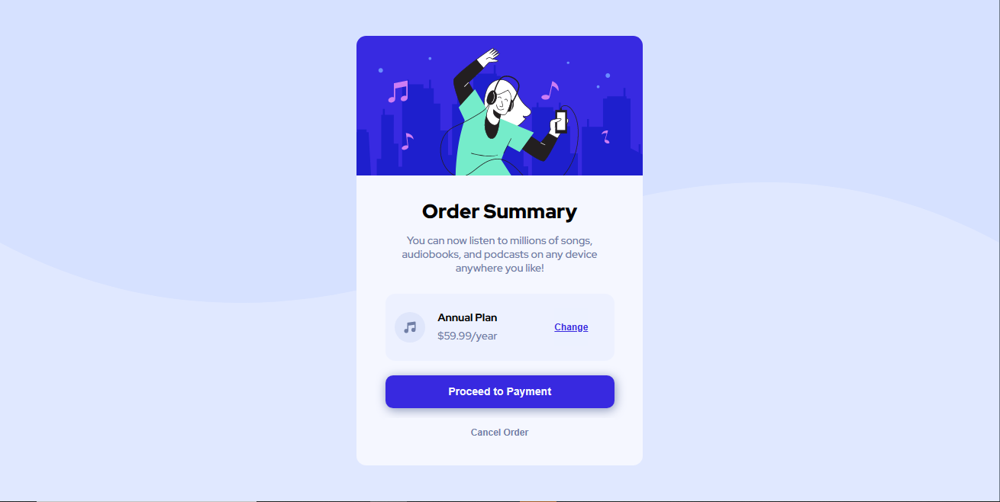

## Pt-Br
------------------------------------------------------------------------------------------------------------------------------------------------ 
# Frontend Mentor - Solução de Componente de Resumo do Pedido
Olá! <br>
Seja muito bem-vindo(a) a minha solução para o desafio do Componente de resumo do pedido feito pelo Frontend Mentor (https://www.frontendmentor.io/challenges/order-summary-component-QlPmajDUj/hub). Este Readme servirá como seu guia para o entendimento deste projeto. Ele terá como base o template disponiblizado pela própria plataforma do Frontend Mentor.
<br>
Sem mais delongas, quero agradeço por disponibiliziar um pouco do seu tempo visitando o meu projeto! :D
Todo feedback é bem-vindo!!

------------------------------------------------------------------------------------------------------------------------------------------------

## Índice

- [Visão Geral](#visão-geral)
    -[Captura de Tela](#captura-de-tela)
- [Meu processo](#meu-processo)
    -[Construído com](#construído-com)
    -[O que aprendi](#o-que-aprendi)
    -[Desenvolvimento Contínuo](#desenvolvimento-contínuo)
- [Autor](#autor)
- [Agradecimentos](#agradecimentos)

------------------------------------------------------------------------------------------------------------------------------------------------

## Visão Geral
### Captura de tela


------------------------------------------------------------------------------------------------------------------------------------------------

## Meu Processo 
### Construído com 
- HTML 
- CSS

### O que aprendi 
Neste projeto decidi treinar box-shadow. Aprendi que a declaração do Box-Shadow é composta por:
box-shadow: h-offset v-offset blur spread(espaçamento da sombra) color.
<br>

``` Box-Shadow
#Payment {
    width: 100%;
    height: 35px;
    box-shadow: 1px 2px 10px hsla(225, 23%, 55%, 0.8);
    margin-top: 15px;
    border: none;
    border-radius: 8px;
    font-size: 0.7em;
    font-weight: 700;
    color: hsl(225, 100%, 98%);
    background-color: hsl(245, 75%, 52%);
}
```


### Desenvolvimento Contínuo
Quero ver até onde consigo trabalhar com essa declaração. Também pretendo estudar novas formas de aplicação da box-shadow. 

------------------------------------------------------------------------------------------------------------------------------------------------

## Autor 
- Frontend Mentor [@StenioVenancius](frontendmentor.io/profile/StenioVenancius)
- Twitter [@veennix](https://twitter.com/veennix)

------------------------------------------------------------------------------------------------------------------------------------------------

## Agradecimentos 
Muito Obrigado por ter lido até aqui ❣️
Sinta-se avontade para enviar seu feedback!

------------------------------------------------------------------------------------------------------------------------------------------------
------------------------------------------------------------------------------------------------------------------------------------------------
## EN
------------------------------------------------------------------------------------------------------------------------------------------------

# Frontend Mentor - Order Summary Component
Hello! <br>
Welcome to my solution to the Frontend Mentor Order Summary Component challenge (https://www.frontendmentor.io/challenges/order-summary-component-QlPmajDUj/hub). This Readme will serve as your guide to understanding this project. It will be based on the template provided by the Frontend Mentor platform itself.
<br>
Without further ado, I want to thank you for taking the time to visit my project! :D
All feedback is welcome!!

------------------------------------------------------------------------------------------------------------------------------------------------

## Table of contents
- [Overview](#Overview)
    -[Screenshot](#screenshot)
- [My process](#my-process)
    -[Built with](#built-with)
    -[What I Learned](#What-I-Learned)
    -[Continuous-Development](#Continuous-Development)
- [Author](#author)
- [Acknowledgments](#acknowledgments)

------------------------------------------------------------------------------------------------------------------------------------------------

## Overview
### Print Screen


------------------------------------------------------------------------------------------------------------------------------------------------

## My Process
### Built with
- HTML
- CSS

### What I learned
In this project I decided to train box-shadow. I learned that the Box-Shadow declaration is composed of:
box-shadow: h-offset v-offset blur spread(shadow spacing) color.
<br>

``` Box-Shadow
#Payment {
    width: 100%;
    height: 35px;
    box-shadow: 1px 2px 10px hsla(225, 23%, 55%, 0.8);
    margin-top: 15px;
    border: none;
    border-radius: 8px;
    font-size: 0.7em;
    font-weight: 700;
    color: hsl(225, 100%, 98%);
    background-color: hsl(245, 75%, 52%);
}
```

### Continuous Development
I want to see how far I can work with that statement. I also intend to study new ways of applying the box-shadow.

------------------------------------------------------------------------------------------------------------------------------------------------

## Author
- Frontend Mentor [@StenioVenancius](frontendmentor.io/profile/StenioVenancius)
- Twitter [@veennix](https://twitter.com/veennix)

------------------------------------------------------------------------------------------------------------------------------------------------

## Acknowledgments
Thank you so much for reading this far ❣️
Feel free to submit your feedback!

------------------------------------------------------------------------------------------------------------------------------------------------